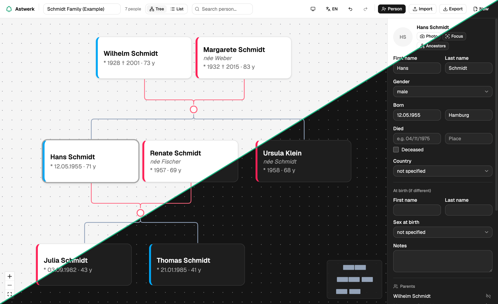

# Astwerk

**A browser-based family tree editor. Runs entirely client-side – no servers, no accounts, no tracking.**

[**▶ Open the live app
**](https://bc-m.github.io/astwerk/) · [Report a bug](https://github.com/bc-m/astwerk/issues) · [Request a feature](https://github.com/bc-m/astwerk/issues)

  

Astwerk (German for *branchwork*) is a free family tree editor that runs entirely in your browser. Build your genealogy, keep it private on your own device, and move it in and out of other tools via GEDCOM — no account, no cloud, no tracking.

## Why Astwerk

- 🔒 **Private by design** — your data stays in your browser; nothing is uploaded, no analytics, no cookies.
- 🆓 **Free & open source** — no account, no paywall, MIT-licensed.
- 📁 **Your data, your file** — export any time as JSON or GEDCOM 5.5.1, import from other genealogy software.
- ⚡ **Fast & focused** — just a tree editor, no upsells or distractions.

## Features

- **Rich person profiles** — names, gender, birth/death dates and places, photo and notes, plus a separate birth identity (name and sex at birth)
- **Build relationships fast** — add or link partners, children and parents
- **Focus mode** — highlight one person's lineage (ancestors, descendants, partners) and dim the rest
- **Search & list view** — jump to anyone from the toolbar, or switch to a searchable table
- **Export the tree** — as PNG or PDF for sharing and printing
- **English & German** — switchable in the toolbar, with light / dark / system themes

## Getting started

Just [open the app](https://bc-m.github.io/astwerk/) — nothing to install. Add your first person, or import an existing `.ged` / `.json` file to pick up where another tool left off. Want to look around first? Load the built-in example tree from the start screen.

## Data & privacy

Everything lives in your browser's local storage — Astwerk has no backend and sends your data nowhere. You stay in control by exporting whenever you like, as a portable JSON file or standards-based GEDCOM 5.5.1.
